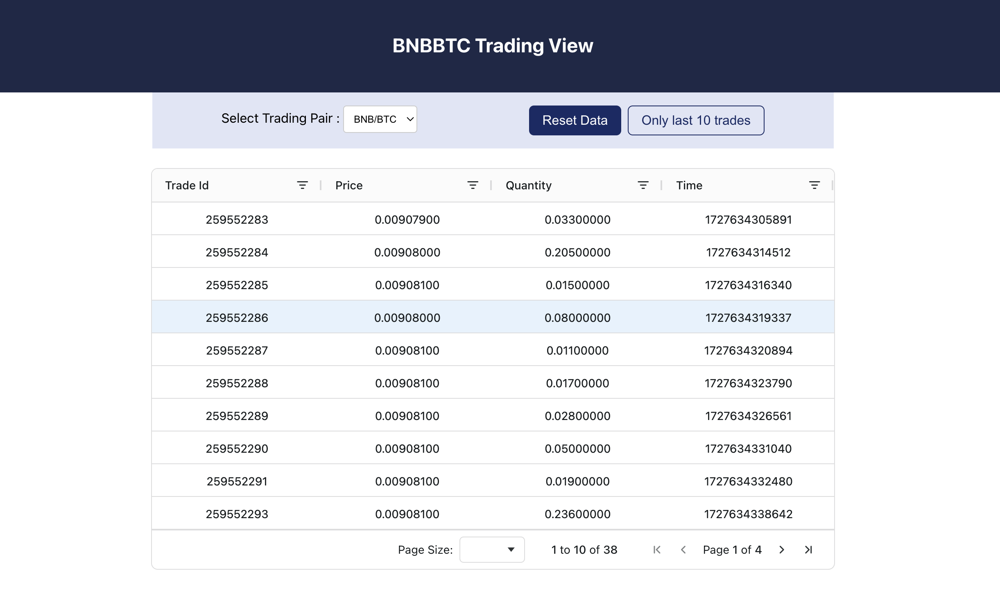
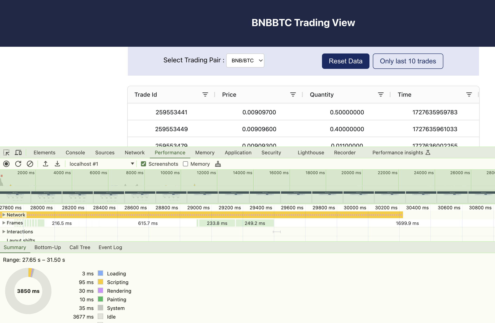

# Trading View

React application using TypeScript that connects to a WebSocket API and displays the data received from the API in real-time.

## Application consist of one page with three sections.

- Header
- Page Actions
- Output

#### - Header view have the instruction about the current trading view

#### - Page Actions is again contain three option

1. Select view to switch between different trading pairs (e.g., ETH/BTC, LTC/BTC). Data will be persisted even after switching between pairs until user resets it.
2. Option to reset the page and start looking at fresh trading data.
3. Option to view only last 10 record. Helps when grid has larger set of data over the time.

#### - Output section comes with trading data in grid. Grid include various features:

1. Filter option on each columns
2. Sorting on each column
3. Pagination at the bottom of the grid with initial page size set to 10 by default can be increase by 20,50,100.
4. Option to move through different pages

### Technical implementation

Application has got the good mix of react features with typescript across all the components. Few highlights like:

- React Context to store the data and pass through components
- React useCallback, useMemo, useEffect, useState
- Component modularization to have better readability, scalability, maintainability and testability

### Folder Structure

- Context.tsx to serve the business logic for getting the data and pass it to components
- Components folder include all the components
  - Header
  - Trading Grid
  - Trading View
  - View Actions
  - Styles

### System requirement to run the application

#### `npm-9.* and node-18.*`

### Available Scripts

To install the dependency required for the application (from the project directory):

#### `npm install`

In the project directory, you can run to start the application:

#### `npm start`

Open [http://localhost:3000](http://localhost:3000) to view it in the browser. The page will reload if you make edits.\

Launches the test runner in the interactive watch mode.

#### `npm run test`

To view the test coverage run

#### `npm run test:coverage`

Builds the app for production to the `build` folder.\
It correctly bundles React in production mode and optimizes the build for the best performance.

#### `npm run build`

## Suggestions

1. Last 10 trade can be done in more details as it open many more functionality
2. Would add tslint/eslint configuration
3. Add more test at low level and boundary conditions

## Output screen

## Performance Matrix of application

